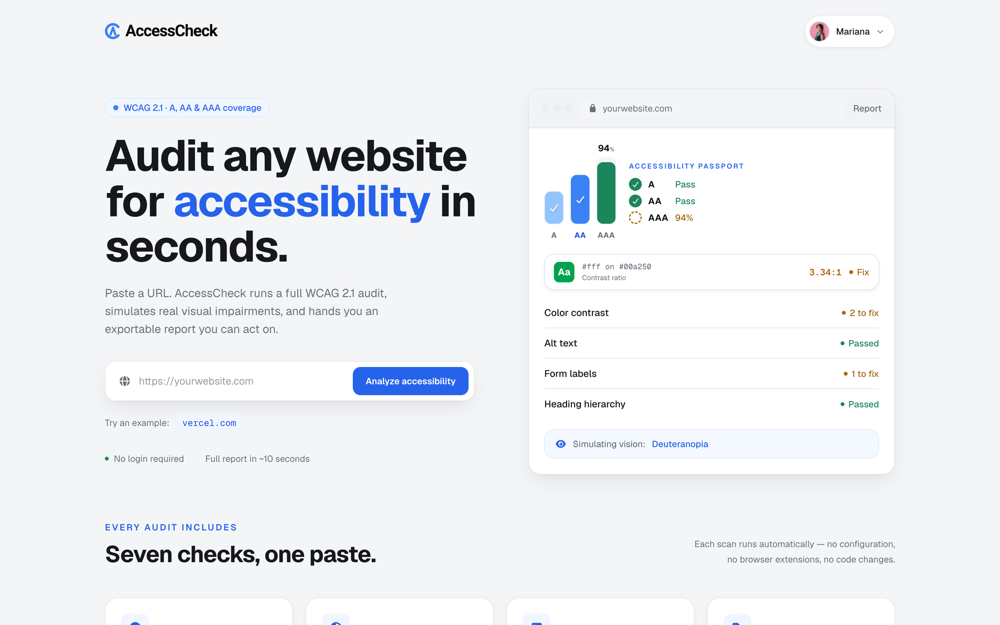
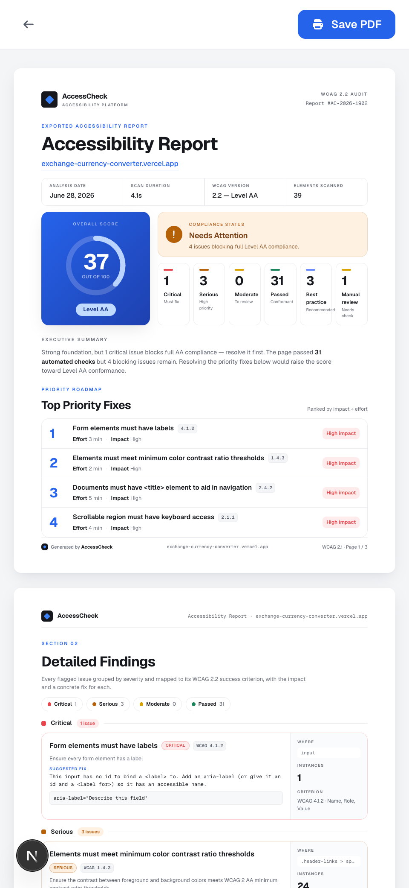
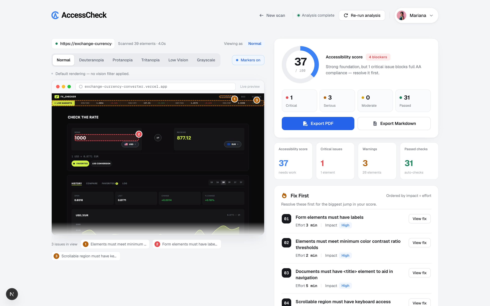

<div align="center">


# AccessCheck

**♿ Accessibility Auditor**

Scan any public URL and get back concrete, verified accessibility fixes. <br/>
Not just a list of problems — the exact code to paste, proven to work.

<br/>

[](https://access-check.marianacastro.dev)
[](#-features)
[](#ℹ%EF%B8%8F-how-to-run-the-application)

</div>

<br/>

## ♿ Features

|  |  |
|---|---|
| **🔧 Copy-Paste Fixes** | Each violation gets a generated code snippet — the exact contrast color, alt text, or label to paste — not just a restated rule. |
| **✅ Verified Fixes** | Every fix is applied in the page and the audit is re-run to prove it actually clears the violation before it's suggested. |
| **👁️ Vision Simulations** | Preview the page through deuteranopia, protanopia, tritanopia, low vision, and grayscale filters to check meaning survives without color. |
| **📊 Score & Export** | A weighted 0–100 score, a prioritized "Fix First" list, and an exportable PDF / Markdown report you can hand to a client or paste into a ticket. |
| **🔍 Beyond Violations** | Surfaces axe's "best practice" recommendations and flags items that need manual review — the two buckets most tools silently discard. |

<br/>

## 🖼️ Screenshots

<table>
  <tr>
    <td align="center" width="62%"><strong>Desktop</strong></td>
    <td align="center" width="38%"><strong>Mobile</strong></td>
  </tr>
  <tr>
    <td valign="top"></td>
    <td rowspan="2" valign="top"></td>
  </tr>
  <tr>
    <td valign="top"></td>
  </tr>
</table>

<br/>

## 🛠️ Tech Stack

<p>
  
  
  
  
  
  
  
  
  
</p>

| Category            | Technologies                                              |
|---------------------|-----------------------------------------------------------|
| **Framework**       | Next.js 16 (App Router), React 19                        |
| **Language**        | TypeScript 5                                             |
| **Styling**         | Tailwind CSS v4                                          |
| **Audit Engine**    | axe-core, Playwright (`playwright-core` + `@sparticuz/chromium`) |
| **Database**        | PostgreSQL (Neon, serverless driver) + Prisma 7          |
| **Authentication**  | Auth.js / NextAuth v5 (GitHub, Google — OAuth only)      |
| **Cache & Rate Limit** | Upstash Redis (HTTP-based, shared across instances)   |
| **Testing**         | Vitest                                                   |
| **Tooling**         | ESLint, Prettier                                         |

<br/>

## 📝 Project Description

AccessCheck is an accessibility auditor that goes one step further than the usual checker. Most tools tell you _what_ is broken; AccessCheck generates the exact code to fix each violation, **proves the fix works by re-running the audit after applying it**, and groups repeated issues so one change can resolve many elements at once.

It renders the page in a real headless browser (Playwright), runs [axe-core](https://github.com/dequelabs/axe-core) against WCAG 2.2 A/AA rules, and turns the raw findings into an actionable report — a live preview with issue markers, color-blindness simulations, an accessibility score, a prioritized "Fix First" list, and an exportable PDF.

The scan runs server-side in a Node runtime (`/api/scan`) because Playwright needs a real browser. Locally it uses the full Playwright Chromium; on serverless it falls back to `playwright-core` + `@sparticuz/chromium`.

**Additional features:**

- **Verified, copy-paste remediation:** The flagship feature. See the [dedicated section](#-the-verified-fix-engine) below — each fix is deterministically generated, applied to the live DOM, and re-audited to label it **Verified** or **Needs review** before it's ever suggested.
- **Anonymous-first, sign-in optional:** The full tool works with no account. Signing in (GitHub or Google, OAuth only) only _adds_ a saved history of your audits — it never gates or degrades the core.
- **Scan history with diffs:** Signed-in scans are saved at `/history` (newest first, with thumbnails, score, and a delta vs the previous scan of the same URL). Opening a saved report shows a **"Changes since last scan"** panel — exactly which rules were **fixed** or **regressed** over time, computed by a pure, unit-tested diff function.
- **Distributed cache & rate limiting:** Anonymous results are cached per URL (5 min) and scans are gated at 5/min per IP via Upstash Redis — shared across serverless instances, and degrading gracefully to no-cache/no-limit when Redis isn't configured.
- **Three-tier reporting:** Results are split into WCAG violations (confirmed failures), best practices (recommendations beyond the spec, clearly labelled as non-blocking), and needs-manual-review items (axe flagged something but can't decide automatically — surfaced with the affected selectors so you know exactly where to look). Most tools collapse these into one list or discard tiers 2 and 3 entirely.
- **Export to PDF & Markdown:** A formatted report view at `/report`, plus a browser-generated Markdown report (score, severity table, Fix First list, every violation with its fix and verification status) perfect for pasting into an issue, PR, or ticket.
- **Responsive layout:** Fully responsive across the landing, results, and exportable report views.

<br/>

## 🔧 The verified-fix engine

The remediation isn't a list of generic advice — it's a small engine that is **concrete** (it writes the code) and **verified** (it proves the code works before suggesting it). The scan pipeline runs server-side:

```
URL → headless Chromium (Playwright) → inject axe-core → WCAG audit
    → deterministic fix generation (per node)
    → cluster identical fixes into groups
    → re-run axe per fix to verify it clears the violation
    → score + markers + report → UI / PDF
```

**It writes the actual fix.** Instead of restating the rule, each violation gets a generated snippet from a deterministic, dependency-free generator ([`src/lib/scan/remediate.ts`](src/lib/scan/remediate.ts)):

- **Color contrast** — computes the nearest passing text color to the original via binary search (on rounded RGB, so the suggested hex actually passes the target ratio) rather than dumping pure black/white.
- **Missing alt text** — infers a description with a cascade: element `title` → surrounding context (figcaption / wrapping link) → filename (stripping `@2x` and extensions), falling back to `alt=""` for decorative images.
- **Form labels & accessible names** — suggests a `<label for>` (when there's an id) or an `aria-label`, guessing the text from placeholder / name / id; covers buttons, links, and ARIA controls without a name.
- **Document-level & ARIA** — missing `<html lang>`, missing `<title>`, zoom-blocking viewport, and the exact required-but-missing or not-allowed ARIA attributes axe reports.

**It proves the fix, doesn't assert it.** Each generated fix carries a structured DOM mutation. After the scan, AccessCheck applies that mutation in the page, re-runs axe scoped to the specific rule, then reverts — labeling each fix:

- **Verified** — the rule no longer flags the element. The fix is proven.
- **Needs review** — the re-scan still flags it; the suggestion isn't enough on its own.
- _(unchecked)_ — fixes that can't be auto-applied safely (e.g. removing ARIA attributes) are left unvalidated rather than faked.

**It groups what repeats.** When many nodes of the same violation share an identical fix (e.g. 14 buttons with the same contrast problem), they collapse into a single group — _"Resolves N elements"_ — validated once per group via a representative selector. This turns "here are 14 problems" into "here is 1 fix that clears 14 elements".

<br/>

## 📌 What did I learn?

The most challenging part of this project was making the remediation **trustworthy** rather than just plausible. Generating a fix is easy; proving it actually clears the violation meant building a structured apply-and-revert layer over a live DOM and re-running the audit scoped to a single rule. Getting the contrast math right — guaranteeing the suggested color passes its WCAG target _after_ rounding — pushed me toward property-based testing. The deterministic core (color math, fix generators, scoring, grouping, and the history diff) is fully unit-tested with Vitest, ensuring reliability and maintainability of the codebase.

<br/>

## ℹ️ How to run the application?

> Clone the repository:

```bash
git clone https://github.com/maricastroc/access-check
```

> Install the dependencies:

```bash
npm install
```

> Rename the .env.example file to .env and add the necessary information to it.
> (The app runs without a database, Redis, or OAuth configured — those only enable history, caching, and sign-in.)

> Start the service:

```bash
npm run dev
```

> Run all tests:

```bash
npm run test
```

> ⏩ Access [http://localhost:3000](http://localhost:3000) to view the web application.

<br/>

<div align="center">

⭐ If you like this project, give it a star on GitHub!

</div>
